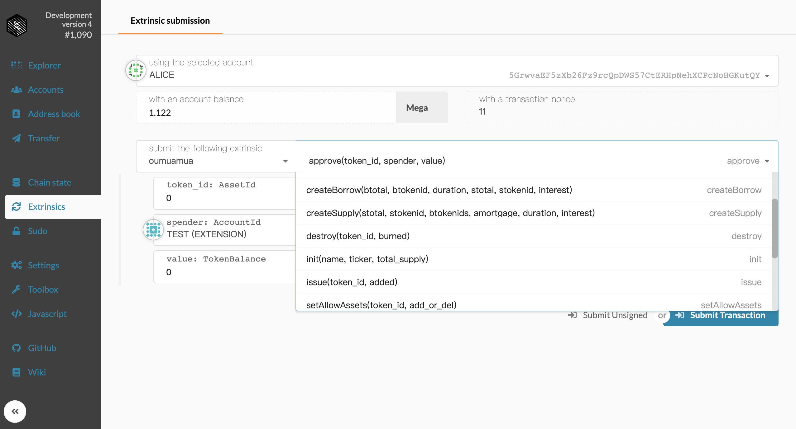

# oumuamua

## 接口 Interface
转币函数：
`transfer(token_id: T::AssetId, to: T::AccountId, value: T::TokenBalance)`
token_id：就是币的编号,u64
to: 就是接受者的账号
value： 币的数量， u64

允许 spender 使用“我” 数量 value 的币
approve(token_id: T::AssetId, spender: T::AccountId, value: T::TokenBalance)

从 from 转 value 数量的币给 to，币是 token_id
transfer_from(token_id: T::AssetId, from: T::AccountId, to: T::AccountId, value: T::TokenBalance) 

创建借款单
`create_borrow(btotal: T::TokenBalance, btokenid: T::AssetId, duration: u64, stotal: T::TokenBalance,   stokenid: T::AssetId, interest: u32)` 
btotal: 想要借多少， u64
btokenid： 想要借的币的种类
duration：持续时间，就是需要借多久 u64 天
stotal：抵押的币的数量 u64
stokenid: 抵押币的种类 u64
interest：u32，年利率，扩大了10000倍，比如本来年利率 6%，这interest 是 600

取消借款单
fn cancel_borrow(orderid: T::Hash) 
orderid，输入一个hash，一个订单的hash

接受借款单
fn take_borrow(origin, borderid: T::Hash)
borderid，订单的 hash

创建资金单
`create_Supply( stotal: T::TokenBalance, stokenid:  T::AssetId, btokenids: Vec<T::AssetId>, amortgage: u32, duration: u64, interest: u32) `

取消资金单
` fn cance_supply(orderid: T::Hash)`

接受资金单
`fn take_supply(origin, sorderid: T::Hash, btokenid: T::AssetId)`

